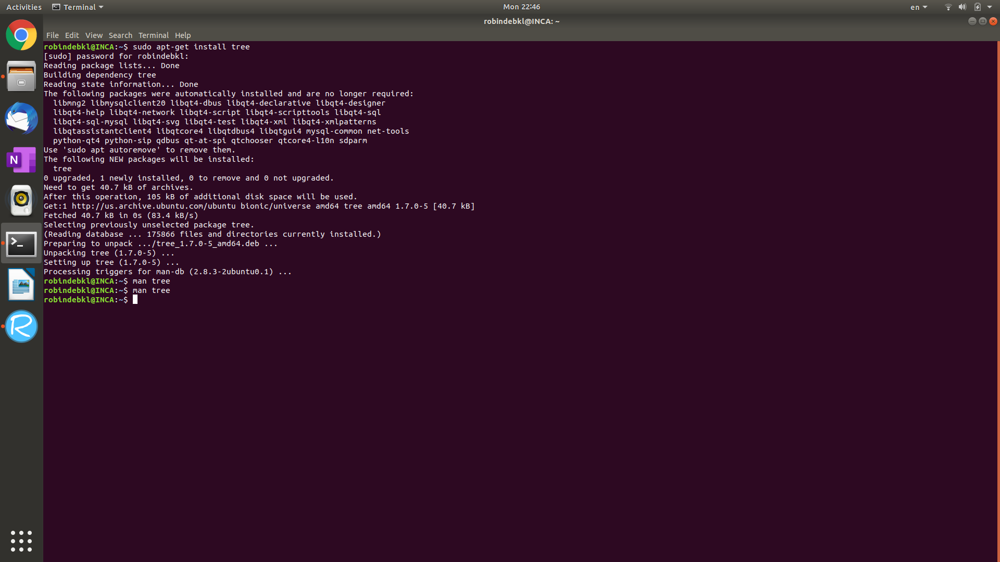
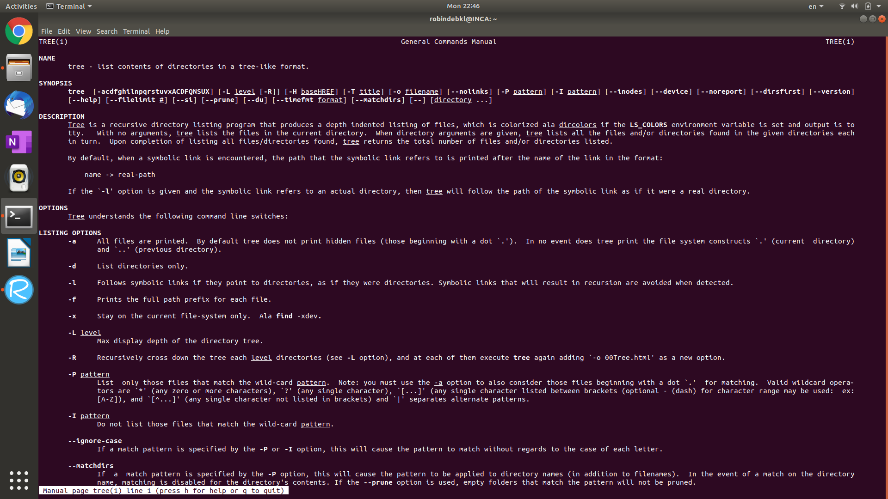
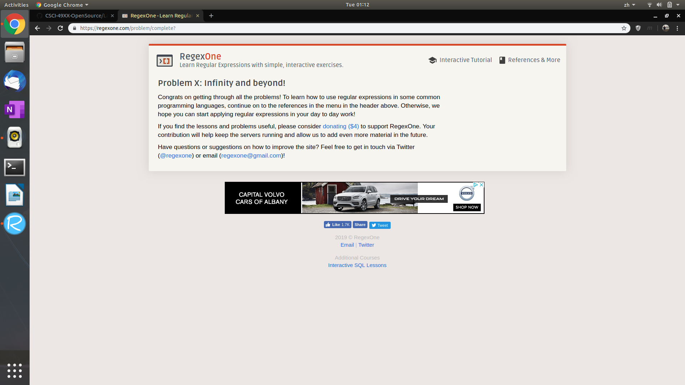
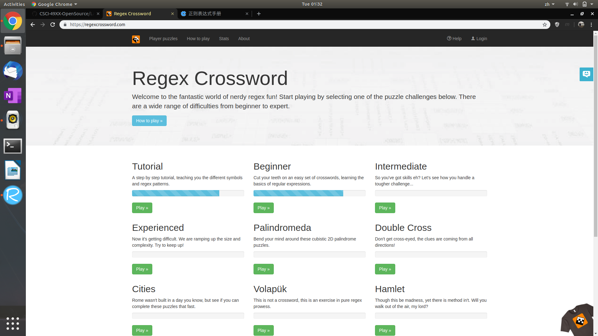
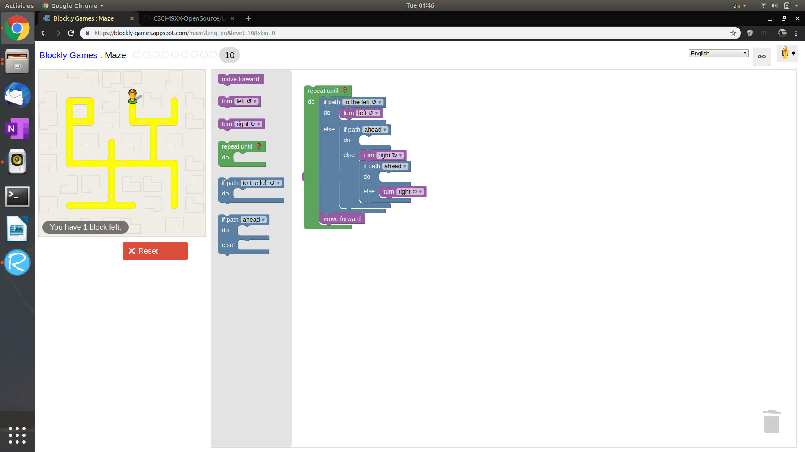

## Name: Robin Hong (hongz)
### Email: hongz@rpi.edu
### GitHub account: ROBINDEBKL
photo of Robin 

### Step #6
**There are ten criteria for open source:**
1. free redistribution
2. source code available
3. derived works allowed
4. integrity of the author's source code
5. no discrimination against persons or groups
6. no discrimination agianst fields of endeavor
7. distribution of license
8. license must not be specific to a product
9. license must not restrict other software
10. license must be technology-neutral
These principles serve to protect the interests of the author, the collaborators, and the community as a whole group, and should have optimal productivity for the community.

### Step #7
Eric Steven Raymond has pointed out a long list of aspects that we should consider in order to ask questions in the smart way. I would like to mark some of his ideas here:
1. use meaningful and specific subject headers to get more useful and proper attention.
2. be precise and informative about my problem (e.g. never copy large contexts or long paragraphs on the manual, but try to intepret instead).
From my personal experience, I have two more things to add:
1. try to confirm the problem with others (let other people do the same stuff and see if the same problem occured to them)
2. try extensive searching both on the web and in the manuals to get some primitive idea about the cause and potential solutions to the problems.

### Step #8
The Intranet is a concept proposed against the Internet, and focuses on the specialty searching engine in local network, usually appeared in business institutions and universities. Jesse started on making a search engine within RPI at early 2000s based on the Microsoft file-sharing system. With months of working, he achieved to make a local network open to all RPI members where almost everything is available. Later he recieved a lawsuit from Recording Industry Association of America due to piracy. RIAA wants Jesse to admit to doing something wrong and he refused. Later the lawsuit is dismissed and Jesse has learned a big lesson: he became an activist about the copyright policy and realized the legal stuff about piracy and sharing.

### Step #13
screenshot of installing tree on Ubuntu terminal 
screenshot of man pages of tree 

### Step #15
I have completed all 8 questions, and here is a screen shot: 

#### Step #16
I have completed four out of five problems and here is the screenshot: 

#### Step #17
I used Blocky to solve the problem. The code uses 9 blocks.

