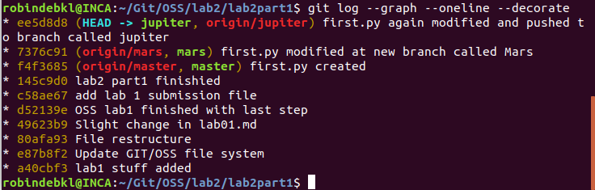
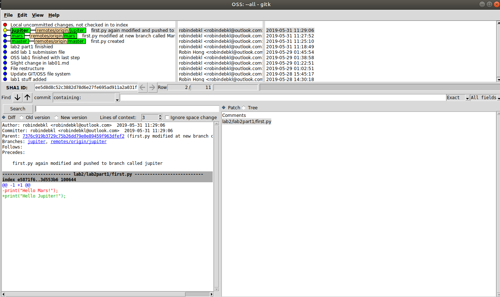
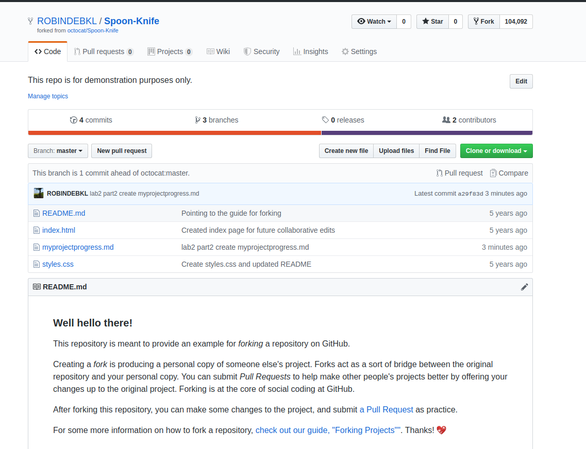
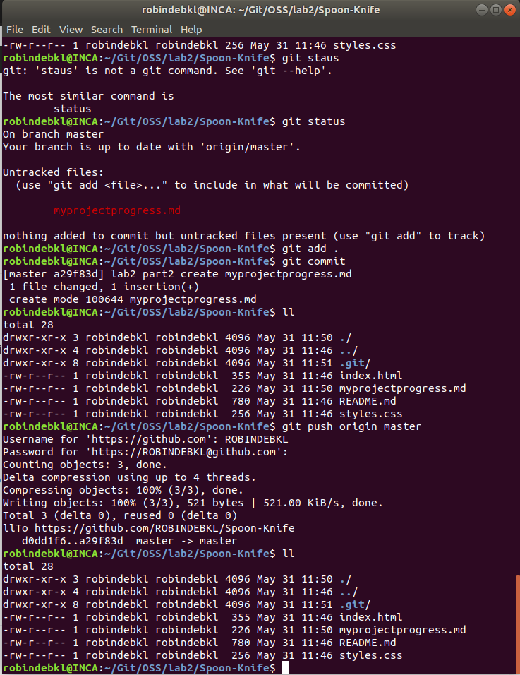
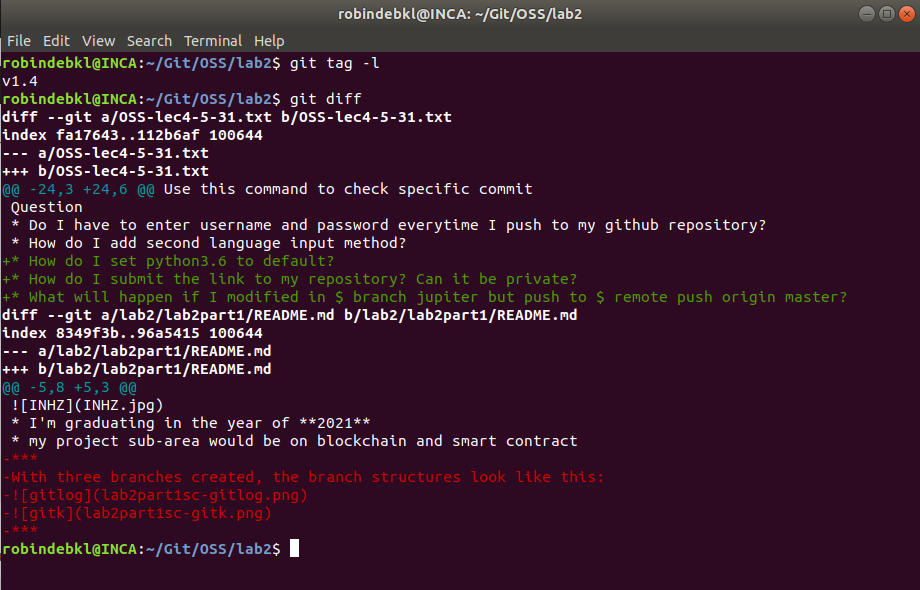

# 5/31 Lab 2
### Part 1
With three branches created, the branch	 structures look like this:

***
### Part 2
I have forked the github page https://github.com/octocat/Spoon-Knife and I got this in my github: https://github.com/ROBINDEBKL/Spoon-Knife.
I have commited a change to my local repository.

***
### Part 3
https://github.com/ROBINDEBKL/PullReq
git diff

git tag

