# Lab 3 - Documentation and Community#### 2019/6/7 Friday, Robin Hong, hongz@rpi.edu

## Part 1 - Documentation###

**github wiki page**

I'm quite interested in the area of artificial intelligence and distributed computing, as I have taken two intro-level courses last semester. For this class of 2019 summer, CSCI 49XX Open Source Software, I would like to explore some open source projects in those fields. The subject of blockchain and smart contract has been really attracting to me. The hyperledger offers a great community for projects on blockchain: [hyperledger fabric](https://www.hyperledger.org/projects/fabric) would be a good and challenging project to explore. It is initiated by Digital Asset and IBM, and has been under active development in recent years. Getting to know a project like this would defintely help me to learn more about the mechanism of open source development and project life cycle.

There are lots of novel ideas behind smart contracts: the potential usability runs the gamut from voting to financial transactions. I really look forward to explore this topic, and potentially writing a blockchain network with hyperledger fabric. Along the develepment, I would like to learn something about nodejs and golang, which is used in IBM blockchain. My end goal would be develop a tool tool for community that can utilize the advantages of decentralization.

**formula in latex**

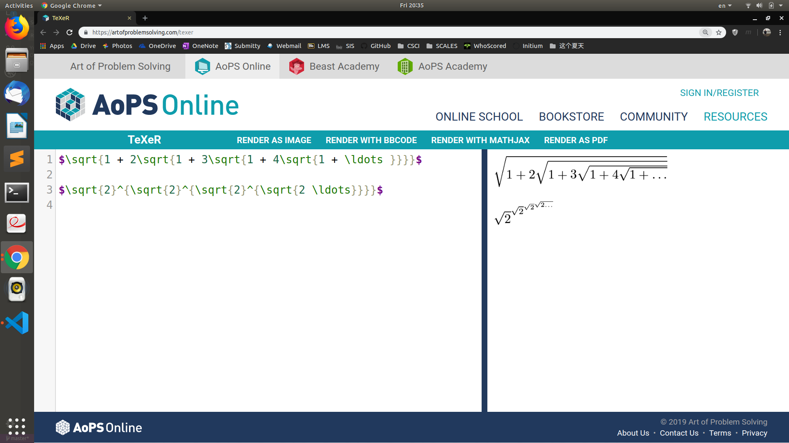

**matrix in latex**

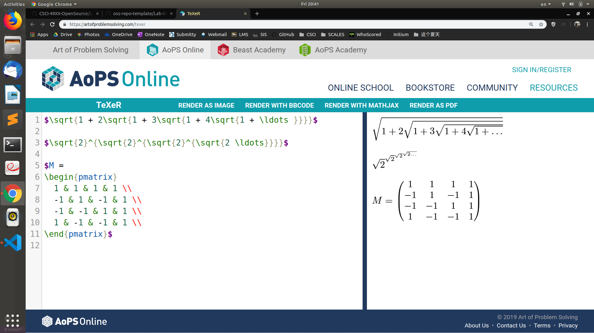

## Part 2 - Community

### Project from RCOS: Organizer
* GitHub: https://github.com/V2grad/Organizer
* The number of contributors: 2
* Number of lines of code: 42703 in total
* The first commit: 2018 September 11, Tuesday
* The latest commit: 2019 May 15, Wednesday
* Current branches: dummy, dev, master

### Project from RCOS: Open Source Curriculum
#### Github Page
* Contributors: 4
* 46674 lines of code
* Init commit: a9538d6ab238ded524ffe82854381a87e2e4a085, November 2, 2018
* Latest commit: c6648cc84948d32e81c9b262769ef52c022eb4c4, March 26, 2019
* 1 branch (master)
#### Gitstats Results
* 42921 lines of code
* 33 commits
* 5 authors

### Project from RCOS: Open Scanner Serial
* Number of contributors: 2
* Number lines of Codes: 13453+10313+6147=29913
* The first commit: commit 806eab08b5594a6f00e5e4951fb12b34460607a7 at Feb/22/2019 by ashapir0
* The last commit: commit 65780bbbb650f3cd0e0ff5b6b468404380073d7c at Apr/27/2019 by bermaj
* Current branches: master

### Project from RCOS: Open IO
* number of contributors: 5
* number of lines of code: 246373, 277846
* first commit:
commit 5d6390cf3ddc5eb20f0cc7f7d542c87e1b8c0f42 (HEAD -> master, origin/master, origin/HEAD) 
Merge: 2359f82 3f45f9f 
Author: Adam Gibbons <42285206+gibboa@users.noreply.github.com> 
Date:   Fri Apr 26 13:31:16 2019 -0400 
    Merge pull request #46 from gibboa/zacknawrocki-patch-5
    typo fix
* last commit:
commit ee8777478e0419de1ba3d49b1d9f45836e3207f5 
Merge: a324695 d6eae81 
Author: Adam Gibbons <gibboa@rpi.edu> 
Date:   Fri Apr 26 12:34:48 2019 -0400 
    Merge branch 'master' into zacknawrocki-patch-3
* current branch: master

**Screenshots of the project**

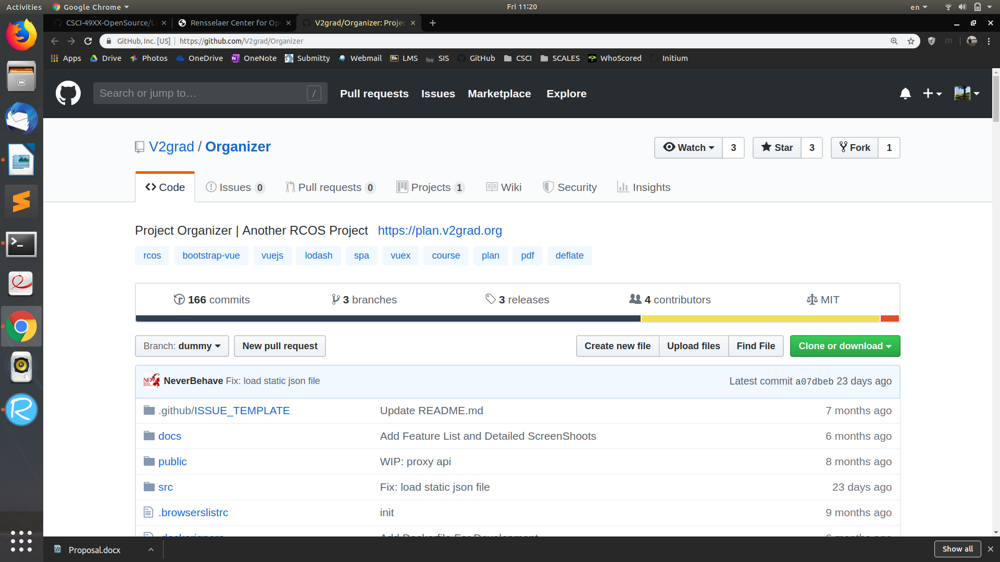
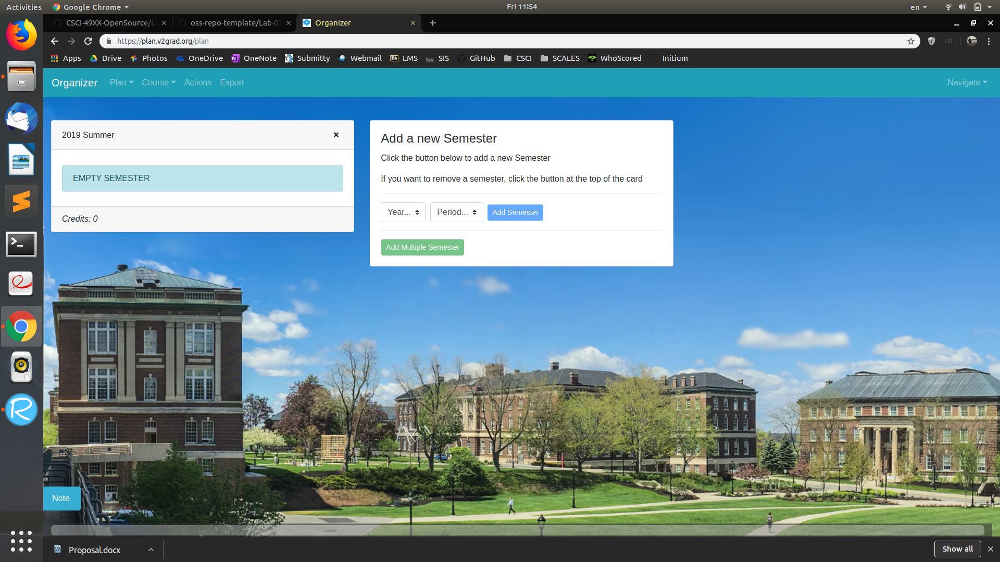
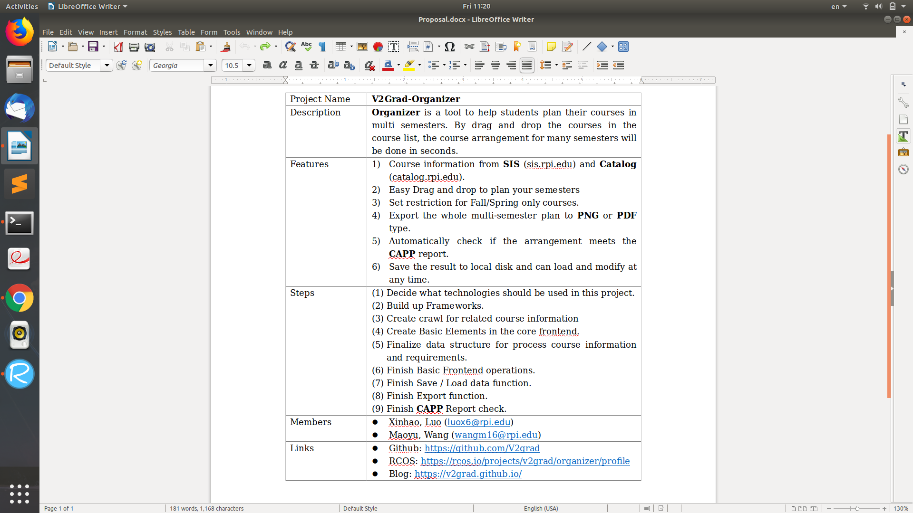

**gitstats**

The number of contributors: 5
Total commits: 166
Total lines of codes: 20560(50722 added, 30162 removed)
Report period: from 2018-09-11 to 2019-05-15

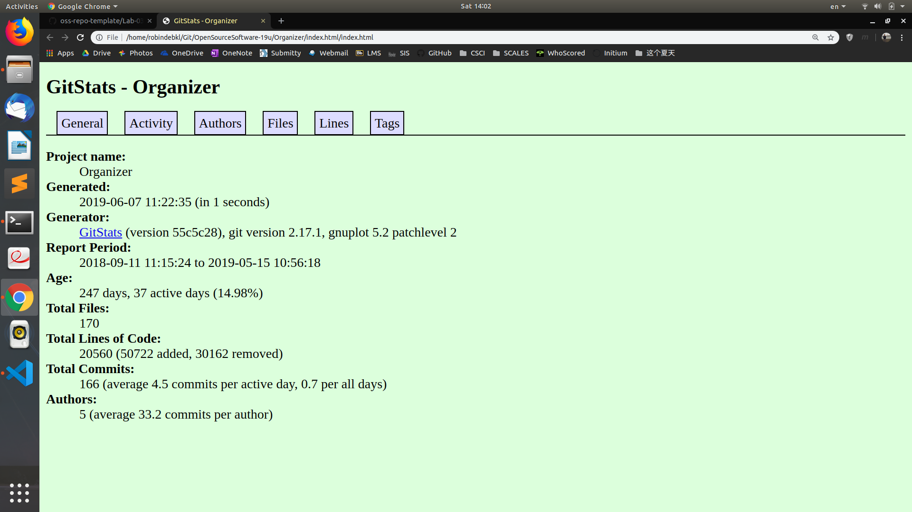
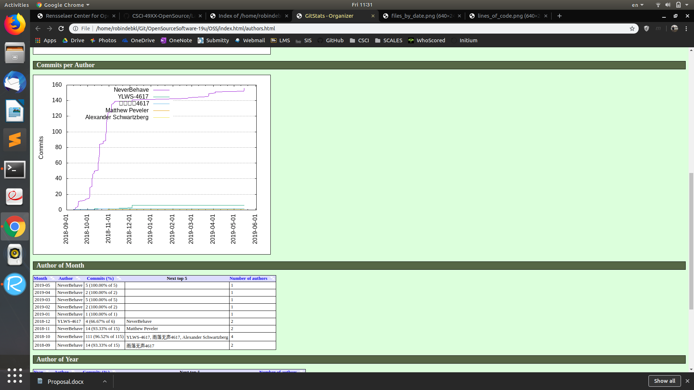
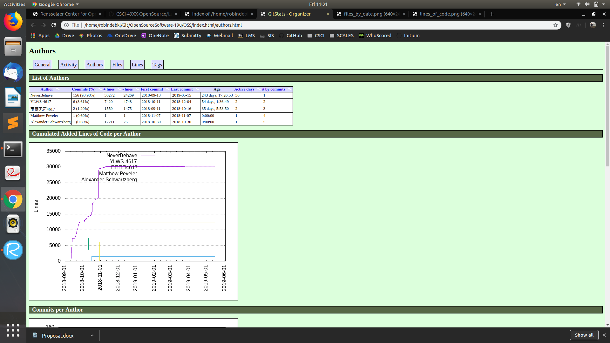
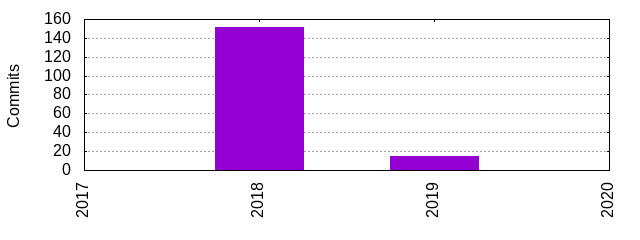
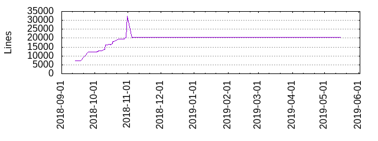
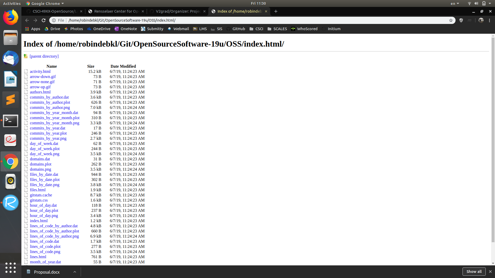
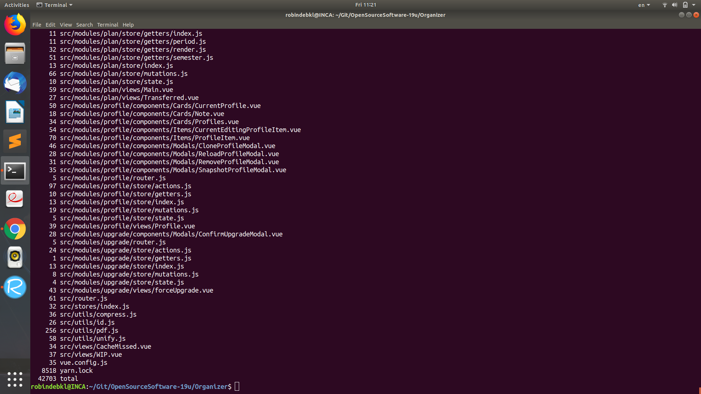

**Analysis**

As the image of gitstats index page shows, the statistics of the project is different from the command line inquiry. In terms of the total lines of code, they differ about 20k, which is quite huge. This might due to the intricate mechanism behind gitstats on how they are counting the codes. Different methods of counting codes may have completely different results.

**streaming with gource**

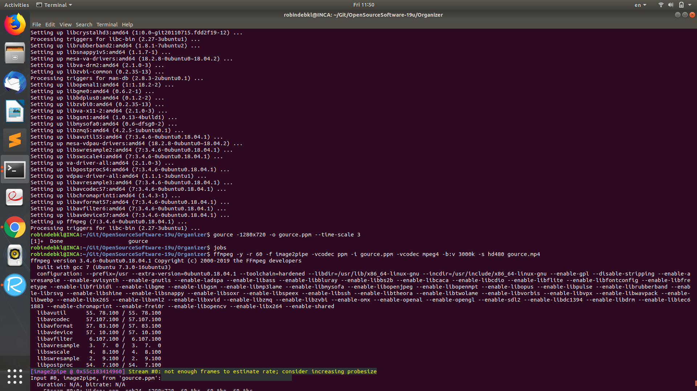
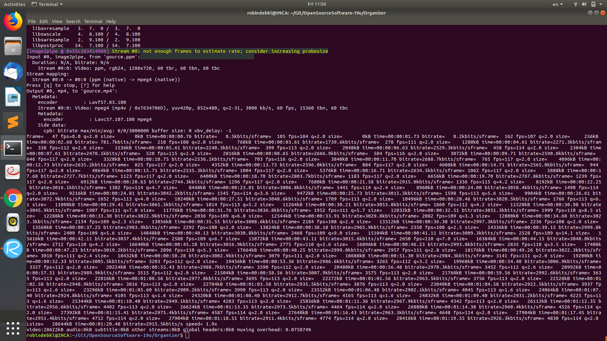
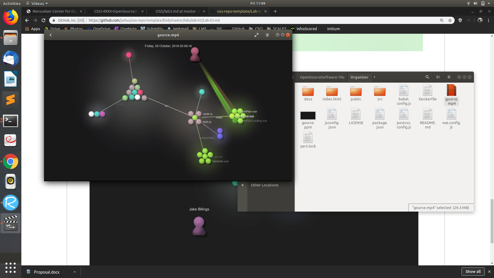

I followed the instructions in the lab page and have installed gnuplot-x11 under Ubuntu 18.04. The command outputs a video with mpeg4 format, around 30MB, and it is really informative about the progress of the coding aspects of the project in the terms of time.
