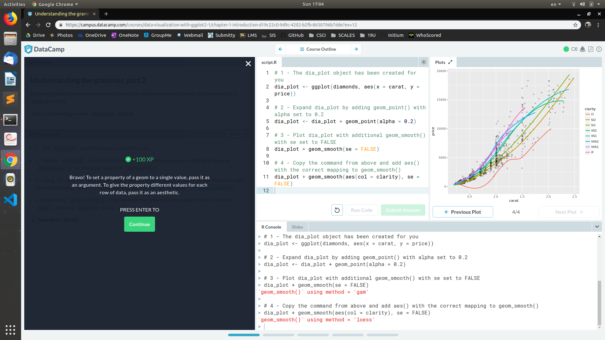

### 2019/7/26, lab 8. Robin Hong, hongz@rpi.edu.
# Statistical Computing

## Step 2
Go to DataCamp and create an account.

## Step 3
Work on the interactive course *Data Visualization with ggplot2 (Part 1)*.

## Step 4
Work on the interactive course *Multiple and Logistic Regression* on datacamp.

## Step 5
[shuttle tracker page on RCOS](https://rcos.io/projects/wtg/shuttletracker/profile)

## Step 6
